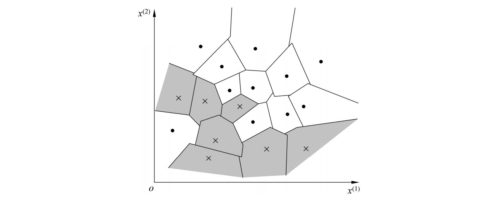
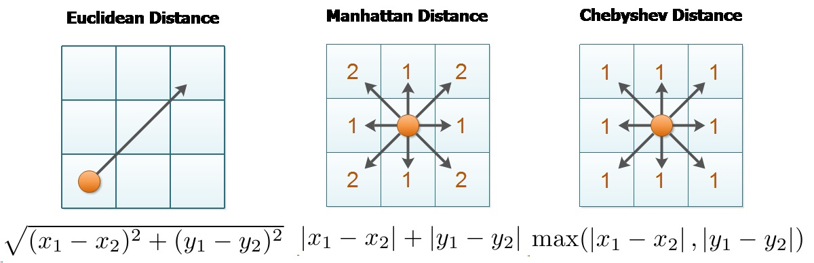
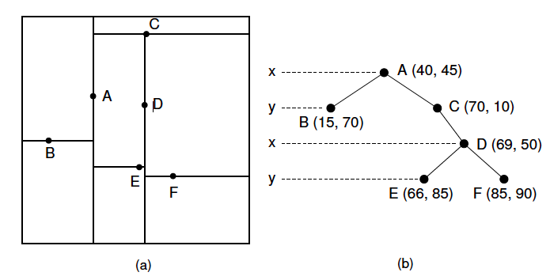

# k近邻法

**k近邻算法**(k-nearest neighbor，k-NN)是1967年由Cover T和Hart P提出的一种用于分类和回归的*无母数统计方法*，是一种基本分类与回归方法。



## 学习策略：

给定一个训练数据集，对于一个新的数据样本，在训练数据集中搜索与该样本最邻近的$k$个样本，并将这$k$个样本的结果通过分类决策得到最终的输出结果。

## 算法：

+ 输入：训练数据集$$T=\{ (x_1，y_1),(x_2，y_2),\dots,(x_N，y_N)\}$$其中$x_i \in \mathcal{X}=R^n$为实例的特征向量，$y_i \in \mathcal{Y}= \{c_1,c_2,\dots c_k\}$为实例的类别，$i=1,2\dots,N$；实例特征向量$x$；
+ 输出：实例$x$所属的类$y$ ；

一、根据给定的距离度量，在训练集$T$中找出与$x$最邻近的$k$个点，涵盖这个$k$个点的$x$的邻域记作

二、在$N_k(x)$中根据分类决策规则（如多数标记）决定$x$的类别$y$：$$y=\arg\min\limits_{c_j}\sum_{x_i \in N_k(x)}I (y_i=c_i),i=1,2,\dots,N;j=1,2,\dots K$$ $I$为指示函数，即当$y_i=c_j$时$I$为1，否则$I$为0。

**注：**$k$近邻法的特殊情况是$k=1$的情形，成为最近邻算法。对于输入的实例点(特征向量)$x$，最邻近法将训练数据集中与$x$最邻近的类作为$x$的类。

## k值的选择：

一、对于k值的选择，没有一个固定的经验，一般根据样本的分布，选择一个较小的值，可以通过交叉验证选择一个合适的k值。

二、选择较小的k值，就相当于用较小的领域中的训练实例进行预测，学习的近似误差会减小，只有与输入实例较近或相似的训练实例才会对预测结果起作用，与此同时带来的问题是泛化误差会增大，换句话说，K值的减小就意味着整体模型变得复杂，容易发生过拟合

三、选择较大的k值，就相当于用较大领域中的训练实例进行预测，其优点是可以减少估计误差，但缺点是近似误差会增大。这时候，与输入实例较远（不相似的）训练实例也会对预测器作用，使预测发生错误，且K值的增大就意味着整体的模型变得简单。

四、如果$k$等于样本数$m$，则完全没有分类，此时无论输入实例是什么，都只是简单的预测它属于在训练实例中最多的类，模型过于简单，完全忽略训练实例中大量有用的信息。

## 距离度量：

特征空间中两个实例点的距离是两个实例点相似程度的反映。$k$近邻模型的特征空间一般是$n$维度向量空间$R^n$。

设特征空间$\mathcal{X}$是$n$维度向量空间$R^n$，$x_1,y_j \in \mathcal{X}$，$x_i=( x_i^{(1)},x_i^{(1)},\dots,x_i^{(1)} )^T$，$x_j=( x_j^{(1)},x_j^{(1)},\dots,x_j^{(1)} )^T$，$x_1,y_j$的$L_p$距离定义为$$L_p(x_i,x_j)=( \sum_{l=1}^{n}  \lvert x_i^{l}-x_j^{l} \rvert ^p )^\frac{1}{p}  \qquad (p \geqslant 1)$$
当$p = 2$时，称为**欧氏距离**（Euclidean distance），即$$L_p(x_i,x_j)=( \sum_{l=1}^{n}  \lvert x_i^{l}-x_j^{l} \rvert ^2)^\frac{1}{2}$$
当$p = 1$时，称为**曼哈顿距离**（Manhattan distance），即$$L_p(x_i,x_j)= \sum_{l=1}^{n}  \lvert x_i^{l}-x_j^{l} \rvert$$
当$p = \infty$时，称为**切比雪夫距离**（Chebyshev distance），它是各个坐标距离的最大值，即
$$L_\infty(x_i,x_j)= \max\limits_{l}\sum_{l=1}^{n}  \lvert x_i^{l}-x_j^{l} \rvert$$



## 实现：KD树

$kd$树是一种对$k$维空间中的实例点进行存储以便对其进行快速检索的树形数据结构。$kd$树是二叉树，表示对$k$维空间的一个划分（partition）。

构造$kd$树相当于不断地用垂直于坐标轴的超平面将$k$维空间划分，构造一系列的$k$维超矩形区域。$kd$树的每个结点对应于与一个$k$维超矩形区域。



### 构造KD树：

#### 算法：

+ 输入：$k$维空间数据集,$T=\{ x_1,x_2,\dots,x_N\}$，其中$x_i=( x_i^{(1)},x_i^{(1)},\dots,x_i^{(1)} )^T$，$i=1,2\dots,N$；
+ 输出：$kd$树

一、开始：构造根结点，根结点对应于包含$T$的$k$维空间的超矩形区域。

选择$x^{(1)}$为坐标轴，以$T$中所有实例的$x^{(1)}$坐标的中位数为切分点，将根结点对应的超矩形区域切分为两个子区域。切分由通过切分点并与坐标轴$x^{(1)}$垂直的超平面实现。

由根结点生成深度为1的左、右子结点：左子结点对应坐标$x^{(1)}$小于切分点的子区域， 右子结点对应于坐标$x^{(1)}$大于切分点的子区域。将落在切分超平面上的实例点保存在根结点。

二、重复：对深度为$j$的结点，选择$x^{(1)}$为切分的坐标轴，$l=j(modk)+1$，以该结点的区域中所有实例的$x^{(1)}$坐标的中位数为切分点，将该结点对应的超矩形区域切分为两个子区域。切分由通过切分点并与坐标轴x $x^{(1)}$垂直的超平面实现。

由该结点生成深度为$j+1$的左、右子结点：左子结点对应坐标$x^{(1)}$小于切分点的子区域，右子结点对应坐标$x^{(1)}$大于切分点的子区域。将落在切分超平面上的实例点保存在该结点。

三、直到两个子区域没有实例存在时停止。从而形成kd树的区域划分。

#### 代码实现：
```Python
class KDTree(object):

    def __init__(self, input_x, input_y):
        self._input_x = np.array(input_x)
        self._input_y = np.array(input_y)
        (data_num, axes_num) = np.shape(self._input_x)
        self._data_num = data_num
        self._axes_num = axes_num
        self._nearest = None  #用来存储最近的节点
        return

    def construct_kd_tree(self):
        return self._construct_kd_tree(0, 0, self._input_x)

    def _construct_kd_tree(self, depth, axes, data):
        if not data.any():
            return None
        axes_data = data[:, axes].copy()
        qs = QuickSort(0, axes_data.shape[0]-1, axes_data)
        medium = qs.get_medium_num() #找到轴的中位数

        data_list = []
        left_data = []
        right_data = []
        data_range = range(np.shape(data)[0])
        for i in data_range:   # 跟中位数相比较
            if data[i][axes] == medium:  #相等
                data_list.append(data[i])
            elif data[i][axes] < medium: 
                left_data.append(data[i])
            else:
                right_data.append(data[i])

        left_data = np.array(left_data)
        right_data = np.array(right_data)
        left = self._construct_kd_tree(depth+1, (axes+1)% self._axes_num, left_data)
        right = self._construct_kd_tree(depth+1, (axes+1)% self._axes_num, right_data)
        #[树的深度，轴，中位数，该节点的数据，左子树，右子树]
        root = [depth, axes, medium, data_list, left, right] 
        return root

    def print_kd_tree(self, root): #打印kd树
        if root:
            [depth, axes, medium, data_list, left, right] = root
            print('{} {}'.format('    '*depth, data_list[0]))
            if root[4]:
                self.print_kd_tree(root[4])
            if root[5]:
                self.print_kd_tree(root[5])
```

### 搜索KD树：

#### 算法：
- 输入：已构造的kd树，目标点$x$;
- 输出：$x$的最近邻;

一、在$kd$树中找出包含目标点$x$的叶结点：从根结点出发，递归地向下访问$kd$树。若目标点$x$当前维的坐标小于切分点的坐标，则移动到左子节点，否则移动到右子节点。直到子节点为叶结点为止。 

二、以此叶节点为“当前最近点” 。

三、递归地向上回退，在每个结点进行一下操作

（a）如果该结点保存的实例点比当前最近点距离目标点更近，则以该实例点为“当前最近点” 。

（b）当前最近点一定存在于该节点一个子节点对应的区域。检查该子节点的父节点的另一子节点对应的区域是否有更近的点。具体地，检查另一子节点对应地区域是否于以目标点为球心、以目标点与“当前最近点”间地距离为半径的超球体相交。

如果相交，可能在另一个子节点对应的区域内存在距目标点更近的点，移动到另一个子节点。接着，递归地进行最近邻搜索。 

如果不相交，向上回退 。

四、当回退到根节点时，搜索结束。最后的“当前最近点”即为$x$的最近邻点。 如果实例点是随机分布的， $kd$树搜索的平均计算复杂度是$Olog(N)$。当空间维数接近训练实例数时，它的效率会迅速下降，近似于线性扫描。

#### 代码实现：
```Python
   def _get_distance(self, x1, x2): #计算两个向量之间的距离
        x = x1-x2
        return np.sqrt(np.inner(x, x))

    def _search_leaf(self, stack, tree, target): #以tree为根节点，一直搜索到叶节点，并添加到stack中
        travel_tree = tree
        while travel_tree:
            [depth, axes, medium, data_list, left, right] = travel_tree
            if target[axes] >= medium:
                next_node = right
                next_direction = 'right' # 记录被访问过的子树的方向
            elif target[axes] < medium:
                next_node = left
                next_direction = 'left' # 记录被访问过的子树的方向
            stack.append([travel_tree, next_direction]) #保存方向，用来记录哪个子树被访问过
            travel_tree = next_node

    def _check_nearest(self, current, target): # 判断当前节点跟目标的距离
        d = self._get_distance(current, target)
        if self._nearest:
            [node, distance] = self._nearest
            if d < distance:
                self._nearest = [current, d]
        else:
            self._nearest = [current, d]

    def search_kd_tree(self, tree, target): #搜索kd树
        stack = []
        self._search_leaf(stack, tree, target) # 一直搜索到叶节点，并将路径入栈
        self._nearest = []
        while stack:
            [[depth, axes, medium, data_list, left, right], next_direction] = stack.pop() #出栈
            [data] = data_list
            self._check_nearest(data, target) #检查当前节点的距离

            if left is None and right is None: #如果当前节点为叶节点，继续下一个循环
                continue
            [node, distance] = self._nearest
            if abs(data[axes] - node[axes]) < distance: #<*> 当前节点的轴经过圆
                if next_direction == 'right': # 判断哪个方向被访问过，转向相反方向
                    try_node = left
                else:
                    try_node = right
                self._search_leaf(stack, try_node, target) #往相反的方向搜索叶节点
        print(self._nearest)
```