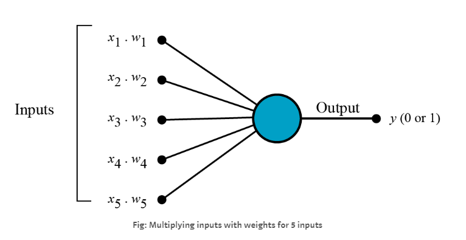
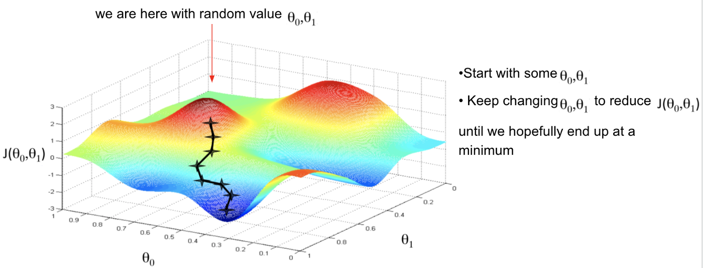

# 感知机

**感知器**（Perceptron）是Frank Rosenblatt在1957年就职于康奈尔航空实验室（Cornell Aeronautical Laboratory）时所发明的一种人工神经网路。它可以被视为一种最简单形式的*前馈神经网路*，是一种*二元线性分类器*。


## 模型定义：

假设输入空间（特征空间）是$\mathcal{X} \subseteq R^n$，输出空间是$\mathcal{Y} =\{+1,-1\}$，输入$x \in \mathcal{X}$表示实例的特征向量，对应于输入空间（特征空间）的点，输出$y \in \mathcal{Y}$表示实例的类别，由输入空间到输出空间的如下函数：$$f(x)=sign(w \cdot x+b)$$称为感知机。

其中，$w$和$b$为感知机模型参数，$w \in R^n$叫作权值（weight）或权值向量（weight vector)，$b \in R^n$叫作偏置（bias），$w \cdot x$表示$w$和$x$的内积。$sign$是符号函数，即$$sign(x)= \left \{ \begin{matrix}
+1, & x \geqslant 0 \\ 
-1, & x < 0
\end{matrix}\right.$$感知机学习，由训练数据集（实例的特征向量和类别）$$T=\{ (x_1，y_1),(x_2，y_2),\dots,(x_N,y_N)\}$$其中$x_i \in \mathcal{X}=R^n$，$y_i=\mathcal{Y}=\{+1,-1\}$，$i=1,2,\dots$，$N$，求得感知机模型，即求得感知机模型参数$w$和$b$，从而将输入实例通过分离超平面将正负二类分离。

## 学习策略：

假设训练数据集是线性可分的，感知机学习的目标是求得一个能够将数据集正实例点和负实例点完全正确分开的超平面。

设超平面$S$为$y = w \cdot x+b$，输出空间$R^n$中任意一点为$x_0$，点$x_0$在超平面$S$上投影点为$x_1$，则有$w \cdot x_1+b=0$
 $$\because \quad \begin{align} \lvert w \cdot \vec{xx_1} \rvert &=\lvert w \rvert \lvert \vec{xx_1} \rvert\ \\ &= \sqrt{(w_1)^2+(w_2)^2+ \dots +(w_N)^2} \cdot d = \lVert w \rVert d \end{align}$$
 $$\because \quad \begin{align} w \cdot \vec{xx_1} &= w^1(x_0^1-x_1^1)+w^2(x_0^2-x_1^2) + \dots +w^N(x_0^N-x_1^N)\\ &= w^1 x_0^1 +w^2 x_0^2 + \dots +w^N x_0^N -(w^1 x_1^1 +w^2 x_1^2 + \dots +w^N x_1^N )\\ &= w^1 x_0^1 +w^2 x_0^2 + \dots +w^N x_0^N - b \end{align}$$
 $$\therefore \quad \begin{align} \lVert w \rVert d &=\lvert w^1 x_0^1 +w^2 x_0^2 + \dots +w^N x_0^N - b \rvert\\&=\lvert w \cdot x_0 +b\rvert \end{align}$$
 $$\therefore \quad d=\frac{1}{\lVert w \rVert}\lvert w \cdot x_0 +b\rvert$$

因此，输入空间$R^n$中任一点$x_0$到超平面的距离为$\frac{1}{\lVert w \rVert}\lvert w \cdot x_0 +b\rvert$，当数据$(x_i,y_i)$被正确分类时，则有$$y_i(w \cdot x_i + b) > 0=\left \{ \begin{matrix}
w \cdot x_i+b > 0, & y = +1 \\ 
w \cdot x_i+b < 0, & y = -1
\end{matrix}\right.$$
所以对于误分类数据$(x_i,y_i)$有$-y_i(w \cdot x_i + b) > 0$，假设超平面S的误分类点集合为$M$，那么所有误分类点到超平面$S$的总距离为$$- \frac{1}{\lVert w \rVert} \sum_{x_i \in M}y_i (w \cdot x_i + b)$$
由于$sign(x)$与数值无关，故此处不考虑$\frac{1}{\lVert w \rVert}$，就得到了感知机学习的损失函数
$$L(w,b) = - \sum_{x_i \in M}y_i (w \cdot x_i + b)$$

从而，使问题转化为求解$$\min\limits_{w,b}L(w,b) = - \sum_{x_i \in M}y_i (w \cdot x_i + b)$$

## 算法：

### 初始形式：

- 输入：训练数据集$T=\{ (x_1，y_1),(x_2，y_2),\dots,(x_N，y_N)\}$，其中$x_i \in \mathcal{X}=R^n$，$y_i=\mathcal{Y}=\{+1,-1\}$，$i=1,2,\dots$，$N$， 学习率$\eta (0<\eta \leqslant 1)$；
- 输出：$w,b$；感知机模型$f(x)=sign(w \cdot x+b)$；

一、选取初值$w_0,b_0$
二、在训练集中选取数据$(x_i,y_i)$ 
三、如果$y_i(w \cdot x_i+b)⩽0$，求解损失函数梯度
$$\begin{align} \triangledown _ wL(w,b)&=-\sum_{x_i \in M}y_i x_i \\
\triangledown _b L(w,b)&=-\sum_{x_i \in M}y_i \end{align}$$
对参数$w,b$ 进行更新
$$\begin{align} w &\leftarrow w + \eta y_i x_i \\ b &\leftarrow b + \eta y_i \end{align}$$
四、转至步骤二，直至训练集中没有误分类点

#### 模型的代码实现：

```Python
class Perceptron:
    def __init__(self):
        self.w = np.ones(len(data[0])-1,dtype=np.float32)
        self.b = 0
        self.l_rate = 0.1
        #定义sign(wx.+b)
    def sign(self,x,w,b):
        y = np.dot(x,w)+b
        return y
    def perdict(self,x_train,y_train):
        is_wrong = False
        while is_wrong != True:
            wrong_count = 0
            for d in range(len(x_train)):
                x = x_train[d]
                y = y_train[d]
                #如果y*sign(wx.+b)小于0
                if y*self.sign(x,self.w,self.b)<=0:
                    #更新参数w，b
                    self.w = self.w + self.l_rate * np.dot(y,x)
                    self.b = self.b + self.l_rate * y
                    wrong_count += 1
            if wrong_count == 0:
                is_wrong = True
        return  self.w,self.b
```

### 对偶形式：

由于$w,b$的梯度更新公式$$\begin{align} w &\leftarrow w + \eta y_i x_i \\ b &\leftarrow b + \eta y_i \end{align}$$  
$w,b$经过了$n$次修改后的，参数可以变化为下公式，其中$a_i=n_i \eta$ $$\begin{align} w&=\sum_{x_i\in{M}}\eta{y_ix_i}=\sum_{i=1}^n\alpha_iy_ix_i \\b&=\sum_{x_i\in{M}}\eta{y_i}=\sum_{i=1}^n\alpha_iy_i \end{align}$$
- 输入：训练数据集$T=\{ (x_1，y_1),(x_2，y_2),\dots,(x_N，y_N)\}$，其中$x_i \in \mathcal{X}=R^n$，$y_i=\mathcal{Y}=\{+1,-1\}$，$i=1,2,\dots$，$N$， 学习率$\eta (0<\eta \leqslant 1)$；
- 输出：$a,b$；感知机模型$f(x)=sign(a_j y_j x_j \cdot x+b)$，其中$a=(a_1,a_2,\dots,a_N)^T$；
一、$a \leftarrow 0,b \leftarrow 0$
二、在训练集中选取数据$(x_i,y_i)$ 
三、如果$y_i(a_j y_j x_j \cdot x+b)⩽0$
$$\begin{align} a &\leftarrow a + \eta \\ b &\leftarrow b + \eta y_i \end{align}$$
四、转至步骤二，直至训练集中没有误分类点

**注：** $Gram$矩阵$G=\begin{bmatrix} x_j \cdot x_i \end{bmatrix}_{N \times N}$可以提前计算减少模型求解的运算量。

#### 代码实现：

```Python
class Perceptron:
    def __init__(self):
        self.alpha = np.zeros(X.shape[0])
        self.b = 0
        self.l_rate = 0.1
    
    def perdict(self, x_train, y_train):
        is_complete = False
        #预先求Gram矩阵
        Gram = np.dot(x_train, x_train.T)
        while is_complete != True:
            wrong_count = 0
            for i in range(X.shape[0]):
                x_, y_ = x_train[i], x_train[i]
                tmp_sum = np.dot(np.multiply(self.alpha, y), Gram[:, i]) 
#或               tmp_sum = 0
#                 for j in range(X.shape[0]):
#                     tmp_sum += self.alpha[j] * y[j] * Gram[j, i]
                if y_ * (tmp_sum+ self.b) <= 0:
                    #更新参数a，b
                    self.alpha[i] += self.lr
                    self.b += self.lr * y_
                    wrong_count += 1
            if not wrong_count:
                is_complete = True
                #求w=sum(a_i*y_i*x_i)
                self.w = np.dot(np.multiply(self.alpha, y), X)
#或               self.w = np.zeros(X.shape[1])
#                 for i in range(X.shape[0]):
#                     self.w += self.alpha[i] * y[i] * X[i]
```

## 特点：

- **好处**
- 简单，容易实现。
- **坏处**  
- 数据集必须线性可分（实际上我们并不知道数据是否线性可分）  
- 就算是线性可分，我们也不无法确定到迭代多少轮才能达到拟合。