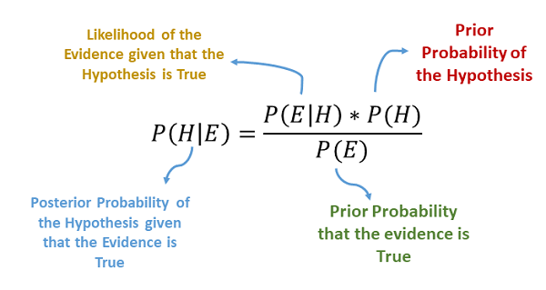

# 朴素贝叶斯

**朴素贝叶斯**（nativ bayes）法是*基于贝叶斯定理与特征条件独立假设*的分类法，对于给定的训练数据集，首先基于特征条件独立假设学习输入输出的联合概率分布，然后基于此模型，对给定的输入$x$，利用贝叶斯定理求出后验概率最大的输出$y$。朴素贝叶斯法实现简单，学习与预测的效率都很高，是一种常用的学习方法。

- 贝叶斯公式的一种表达$$P(类别 \vert 特征)=\frac{P(特征 \vert 类别)P(类别)}{P(特征)}$$
## 学习策略：

设输入空间$\mathcal{X} \in R^n$为$n$维向量的集合，输出空间为类标记集合$\mathcal{Y}=\{c_1,c_2,\dots,c_K\}$，输入为特征向量$x \in \mathcal{X}$，输出为类标记（class label）$y \in \mathcal{Y}$。$X$是定义在输入空间$\mathcal{X}$上的随机变量，$Y$是在输出空间$\mathcal{Y}$上的随机变量。$P(X,Y)$是$X$和$Y$的联合概率分布。训练数据集：$$T=\{ (x_1，y_1),(x_2，y_2),\dots,(x_N，y_N)\}$$由$P(X,Y)$独立同分布产生。

朴素贝叶斯法通过训练数据集学习联合概率分布$P(X,Y)$。具体地，学习以上先验概率分布及条件概率分布。先验概率分布为：$$P(Y=c_k),k=1,2\dots,K$$条件概率分布：$$P(X=x \vert Y=c_k)=P(X^{(1)}=x^{(1)},\dots,X^{(n)}=x^{(n)} \vert Y=c_k),k=1,2\dots,K$$于是学习到联合概率分布$P(X,Y)$。

条件概率分布$P(X=x \vert Y=c_k)$有指数级数量的参数，其估计实际是不可行地。事实上，假设$x{(j)}$可取值$S_j$个，$j=1,2,\dots,n$，$Y$可取值有$K$个，那么参数个数为：$$K \prod_{j=1}^{n}S_j$$
由链式法则可推断：$$\begin{align} P(X=x \vert Y=c_k)&=P(X^{(1)}=x^{(1)},\dots,X^{(n)}=x^{(n)} \vert Y=c_k) \\&= \prod_{j=1}^{n}P(X^{(j)}=x^{(j)} \vert Y=c_k) \end{align}$$
朴素贝叶斯法分类时，对给定的输入$x$，通过学习到的模型计算后验概率分布$P(X=x \vert Y=c_k)$，将后验概率最大的类作为的类输出。后验概率计算通过贝叶斯定理进行：$$\begin{align} P(Y=c_k \vert X=x)&=\frac{P(X=x \vert Y=c_k)P(Y=c_k)}{\sum_k P(X=x \vert Y=c_k)P(Y=c_k)}\end{align}$$
$$\because P(X=x \vert Y=c_k) = \prod_{j=1}^{n}P(X^{(j)}=x^{(j)} \vert Y=c_k) $$
$$\therefore \begin{align} P(Y=c_k \vert X=x)&=\frac{P(Y=c_k)\prod_{j}P(X^{(j)}=x^{(j)} \vert Y=c_k)}{\sum_k P(Y=c_k)\prod_{j}P(X^{(j)}=x^{(j)} \vert Y=c_k)}\end{align}$$
于是，朴素贝叶斯分类器可以表示为$$y=f(x)=\arg\max\limits_{c_k}\frac{P(Y=c_k)\prod_{j}P(X^{(j)}=x^{(j)} \vert Y=c_k)}{\sum_k P(Y=c_k)\prod_{j}P(X^{(j)}=x^{(j)} \vert Y=c_k)}$$
注意到，式中分母对所有$c_k$都是相同的，都是$P(X^{(j)}=x^{(j)})$，所以可简化为
$$y=\arg\max\limits_{c_k}P(Y=c_k)\prod_{j}P(X^{(j)}=x^{(j)} \vert Y=c_k)$$

问题从而转为为求解$$\arg\max\limits_{c_k}P(Y=c_k)\prod_{j}P(X^{(j)}=x^{(j)} \vert Y=c_k)$$
## 算法

- 输入：训练数据集$$T=\{ (x_1，y_1),(x_2，y_2),\dots,(x_N，y_N)\}$$其中$x_i=(x_i^{(1)},x_i^{(2)},\dots,x_i^{(n)})^T$，$x_i^{(j)}$是第$i$个样本的第$j$个特征，$x_i^{(j)}=(a_{j1},x_{j2},\dots,x_{jS_j})$，$a_{jl}$是第$j$个特征可能取的第$l$个值，$j=1,2,\dots,n,l=1,2,\dots,S_j,y_i \in\{c_1,c_2,\dots,c_K\}$，实例$x$；
- 输出：实例$x$的分类；

一、计算先验概率及条件概率$$P(Y=c_k)=\frac{\sum_{i-1}^N I(y_i=c_k)}{N},\quad k=1,2,\dots,K$$
$$\begin{align} P(&X^{(i)}=a_{jl} \vert Y=c_k)=\frac{\sum_{i=1}^NI(x_i^{(j)}=a_{jl}，y_i=c_k)}{\sum_{i=1}^NI(y_i=c_k)} \\\\&j=1,2,\dots,n;\quad l=1,2,\dots,Sj;\quad k=1,2,\dots,K \end{align}$$
二、对于给定的实例$x_i=(x_i^{(1)},x_i^{(2)},\dots,x_i^{(n)})^T$，计算$$P(Y=c_k)\prod_{j}P(X^{(j)}=x^{(j)} \vert Y=c_k),\quad k=1.2.\dots,K$$
三、 确定实例$x$的类$$y=\arg\max\limits_{c_k}P(Y=c_k)\prod_{j}P(X^{(j)}=x^{(j)} \vert Y=c_k)$$
## 伯努利朴素贝叶斯

**伯努利分布（Bernoulli distribution）**，又名两点分布或者0-1分布，是一个离散型概率分布。伯努利模型适用于离散特征的情况，但只适用于特征只能取值为1或0（T or F）的情况

若伯努利试验成功，则伯努利随机变量取值为1。若伯努利试验失败，则伯努利随机变量取值为0。记其成功概率为$\mu(0{\le}\mu{\le}1)$，失败概率为$1-\mu$。
$$\begin{align} &{p(x=1|\mu)=\mu,}\\ &{p(x=0|\mu)=1-\mu,}\end{align}  \quad x\in \{1,\ 0\} $$则有伯努利分布
$$Bern(x|\mu)=P(X=x)=\mu^x(1-\mu)^{1-x}$$
其期望为$E(X)=\sum_{i=0}^1 x_1 \mu^x(1-\mu)^{1-x}=p$，
其方差$Var(X)=\sum_{i=0}^1 (X_i-E(X))^2 \mu^x(1-\mu)^{1-x}=\mu(1-\mu)$，

存在输入空间$\mathcal{X} \in R^n$为$n$维向量的集合，输出空间为类标记集合$\mathcal{Y}=\{c_1,c_2,\dots,c_K\}$，$x_i=(x_i^{(1)},x_i^{(2)},\dots,x_i^{(n)})$，$x_i^{(j)}$是第$i$个样本的第$j$个特征，$x_i^{(j)}=(a_{j1},x_{j2},\dots,x_{jS_j})$ ，$\mu_{kj}$表示特征$x_{(j)}$属于分类$c_k$的可能性，则推断：
$$\begin{align} P(X=x \vert Y=c_k)&=P(X^{(1)}=x^{(1)},\dots,X^{(n)}=x^{(n)} \vert Y=c_k) \\&= \prod_{j=1}^{n}P(X^{(j)}=x^{(j)} \vert Y=c_k) \\&= \prod_{j=1}^{n} \mu_{kj}^{x^{(j)}}(1-\mu_{kj})^{1-x^{(j)}} \end{align}$$
$$\because \quad \begin{align} P(Y=c_k \vert X=x)&=\frac{P(X=x \vert Y=c_k)P(Y=c_k)}{\sum_k P(X=x \vert Y=c_k)P(Y=c_k)} \\&= \frac{P(Y=c_k)\prod_{j=1}^{n} \mu_{kj}^{x^{(j)}}(1-\mu_{kj})^{1-x^{(j)}}}{\sum_k P(Y=c_k)\prod_{j=1}^{n} \mu_{kj}^{x^{(j)}}(1-\mu_{kj})^{1-x^{(j)}}} \end{align}$$

忽略分母简化得伯努利朴素贝叶斯分类器，
$$\therefore \quad y=f(x)=\arg\max\limits_{c_k}P(Y=c_k)\prod_{j} \mu_{kj}^{x^{(j)}}(1-\mu_{kj})^{1-x^{(j)}}$$
## 多项式朴素贝叶斯

**多项分布（Multinomial Distribution）**，将伯努利分布的单变量扩展到d维向量，多项分布是二项分布的推广，是多元离散型随机现象重要的一种。当特征是离散的时候，使用多项式模型。

将伯努利分布的单变量扩展到$d$维向量$\vec{x}$，其中$x_i \in 0$，$\mu \in [0,1]$，且进行d次独立试验，有$\sum_{i=1}^d \mu_i=1$，则有多项式分布
$$Mult(m_1,m_2,\dots,m_d \vert n,\mu)=\frac{n!}{m_1!m_2!\dots m_d!}\prod_{i=1}^d{\mu_{i}^{m_d}}$$

其期望为$E(X)=m\mu$，
其方差$Var(X)=m\mu_i(1-\mu_i)$

存在输入空间$\mathcal{X} \in R^n$为$n$维向量的集合，输出空间为类标记集合$\mathcal{Y}=\{c_1,c_2,\dots,c_K\}$，$x_i=(x_i^{(1)},x_i^{(2)},\dots,x_i^{(n)})$，$x_i^{(j)}$是第$i$个样本的第$j$个特征，$x_i^{(j)}=(a_{j1},x_{j2},\dots,x_{jS_j})$，$\mu_{kj}$表示特征$x^{(j)}$属于分类$c_k$的可能性，做$N$次独立试验有：$$\because \quad \begin{align} P(X=x \vert Y=c_k)&=P(X^{(1)}=x^{(1)},\dots,X^{(n)}=x^{(n)} \vert Y=c_k) \\&= P(\lvert X \rvert) \frac{N!}{x^1!x^2!\dots x^n! }\prod_{j=1}^{n}P(\mu_i \vert Y=c_k)^{x^j} \end{align}$$
$$\therefore \quad P(Y=c_k \vert X=x)=\frac{P(Y=c_k) \frac{N!}{x^1!x^2!\dots x^n! }\prod_{j=1}^{n}P(\mu_i \vert Y=c_k)^{x^j}}{P(X=x)}$$
忽略分母简化得多项朴素贝叶斯分类器，
$$\therefore \quad \begin{align}  y&=\arg\max\limits_{c_k} P(Y=c_k) \frac{N!}{x^1!x^2!\dots x^d! }\prod_{j=1}^{n}P(\mu_i \vert Y=c_k)^{x^j} \\&=\arg\max\limits_{c_k} P(Y=c_k)P(X=x \vert Y=c_k)  \end{align} $$
再有，在对数空间中，多项朴素贝叶斯分类器变成了线性分类器：$$ \begin{align} logP(Y=c_k \vert X=x)&=log(\arg\max\limits_{c_k} P(Y=c_k)P(X=x \vert Y=c_k))\\&=\arg\max\limits_{c_k}log P(Y=c_k)+\sum_{j=1}^n x^{(j)}P(X=x \vert Y=c_k) \end{align}$$
$$\therefore \quad y=\arg\max\limits_{c_k}log P(Y=c_k)+\sum_{j=1}^d x^{(j)}P(X=x \vert Y=c_k)$$
## 高斯朴素贝叶斯

**高斯分布(Gaussian distribution)**，又称正态分布，是一个常见的连续概率分布。
当特征是连续变量的时候，运用多项式模型在不做平滑的情况下容易导致 $P(Y = c_k)=0$，此时即使做平滑，所得到的条件概率也难以描述真实情况，所以处理连续的特征变量，应该采用高斯模型。

若随机变量$X$服从一个位置参数为$\mu$、尺度参数为$\sigma$的正态分布，为$X \sim N(\mu,\sigma^2)$，则有高斯分布$$N(x \vert\mu,\sigma^2) = \frac{1}{\sqrt{2\pi }\sigma}\mathrm{e}^{-\frac{(x-\mu)^2}{2\sigma^2}}$$
存在输入空间$\mathcal{X} \in R^n$为$n$维向量的集合，输出空间为类标记集合$\mathcal{Y}=\{c_1,c_2,\dots,c_K\}$，$x_i=(x_i^{(1)},x_i^{(2)},\dots,x_i^{(n)})$，$x_i^{(j)}$是第$i$个样本的第$j$个特征，$x_i^{(j)}=(a_{j1},x_{j2},\dots,x_{jS_j})$ ，$\mu_{kj}$表示特征$x_{(j)}$属于分类$c_k$的可能性，则推断：
$$P(X=x\mid y=c_k)=\dfrac{1}{\sqrt {2\pi \sigma_k^2}} \mathrm{e}^{-\dfrac{(x^{(j)}-\mu_k)^2}{2\sigma_k^2}}$$
简化得，
$$\because \quad \begin{align} P(Y=c_k \vert X=x)&=\frac{P(X=x \vert Y=c_k)P(Y=c_k)}{\sum_k P(X=x \vert Y=c_k)P(Y=c_k)}\\&  
\propto P(Y=c_k)P(X^{(j)}=x^{(j)} \vert Y=c_k) \end{align}$$
由此，高斯朴素贝叶斯分类器为
$$\therefore \quad y=\arg\max\limits_{c_k}P(Y=c_k)P(X=x\mid y=c_k)$$
## 极大似然估计

**极大似然估计**（Maximum Likelihood Estimation，MLE），也称最大似然估计，是用来*估计一个概率模型的参数的一种方法*。其目的是利用已知的样本结果信息，反推最具有可能（最大概率）导致这些样本结果出现的模型参数值。

极大似然估计中采样需满足一个重要的假设，就是所有的采样都是独立同分布的。

在朴素贝叶斯法中，学习意味着估计$P(Y=c_k)$和$P(X^{(j)}=x^{(j)} \vert Y=c_k)$。可以应用极大似然估计发估计相应的概率。

先验概率$P(Y=c_k)$的极大似然估计是：$$P(Y=c_k \vert )=\frac{\sum_{i-1}^N I(y_i=c_k)}{N},\quad k=1,2,\dots,K$$
设第$j$个特征$x^{(j)}$可能取值的集合为$\{a_{j1}，a_{j2}，\dots,a_{jS_j}\}$，条件概率$P(Y=c_k \vert X=x)$的极大似然估计是$$\begin{align} P(&X^{(i)}=a_{jl} \vert Y=c_k)=\frac{\sum_{i=1}^NI(x_i^{(j)}=a_{jl}，y_i=c_k)}{\sum_{i=1}^NI(y_i=c_k)} \\\\&j=1,2,\dots,n;\quad l=1,2,\dots,Sj;\quad k=1,2,\dots,K \end{align}$$式中，$x_i^{(j)}$是第$i$个样本的第$j$个特征；$a_{jl}$是第$j$个特征可能取的第$l$个值，$I$为指示函数。

**零概率问题**：在计算事件的概率时，如果某个事件在观察样本库（训练集）中没有出现过，会导致该事件的概率结果是$0$ 。这是不合理的，不能因为一个事件没有观察到，就被认为该事件一定不可能发生（即该事件的概率为$0$）

**贝叶斯估计**：极大似然估计可能会出现所要估计的概率值为0的情况。这时会影响到后验概率的计算结果，使分类产生偏差。解决这一问题的方法是采用贝叶斯估计。
$$P_{\lambda}(Y = c_k) = \frac{\sum_{i=1}^{N} I(y_i = c_k) + \lambda}{N + k \lambda}$$
$$P(X^{(j)} = a_{jl} \ | \ Y = c_k) = \frac{\sum_{i=1}^{N} I(x_i^{(j)} = a_{jl}, y_i = c_k) + \lambda}{\sum_{i=1}^{N}I(y_i = c_k) + S_j \lambda}$$
$λ=0$时称为极大似然估计，$λ=1$时称为拉普拉斯平滑。

**拉普拉斯平滑（Laplacian smoothing）**：又被称为加 1 平滑，是比较常用的平滑方法。平滑方法的存在时为了解决零概率问题。

对于一个随机变量$\mathrm{z}$ , 它的取值范围是$\{1,2,\dots,k\}$, 对于$m$次试验后的观测结果$\left\{\mathrm{z}^{(1)}, \mathrm{z}^{(2)}, \mathrm{z}^{(3)}, \ldots, \mathrm{z}^{(\mathrm{m})}\right\}$, 极大似然估计按照下式计算：$$\varphi_{j}=\frac{\sum_{i=1}^{m} I \{z^{(i)}=j\}}{m}$$应用拉普拉斯平滑后，式子变为：$$\varphi_{j}=\frac{\sum_{i=1}^{m} I\{z^{(i)}=j\}+1}{m+\mathrm{k}}$$
即分子$+1$，分母加上类别总量。

## 特点

- **优点**
- 需要少量的训练数据。所以训练时间更短。
- 处理连续和离散数据，对无关特征不敏感。
- 非常简单、快速且易于实施。
- 可用于二分类和多分类问题。
- 高度可扩展，因为它随着预测特征和数据点的数量线性扩展。
- 当朴素贝叶斯条件独立假设成立时，它将比逻辑回归等判别模型更快地收敛。

- **缺点：**
- 独立预测变量/特征的假设。朴素贝叶斯隐含地假设所有属性都是相互独立的，这在现实世界的数据中几乎是不可能找到的。
- 如果分类变量的值出现在测试数据集中，但在训练数据集中没有观察到，则模型将为其分配零概率，并且无法进行预测。这就是我们所说的**零频率问题**，可以使用平滑技术来解决。